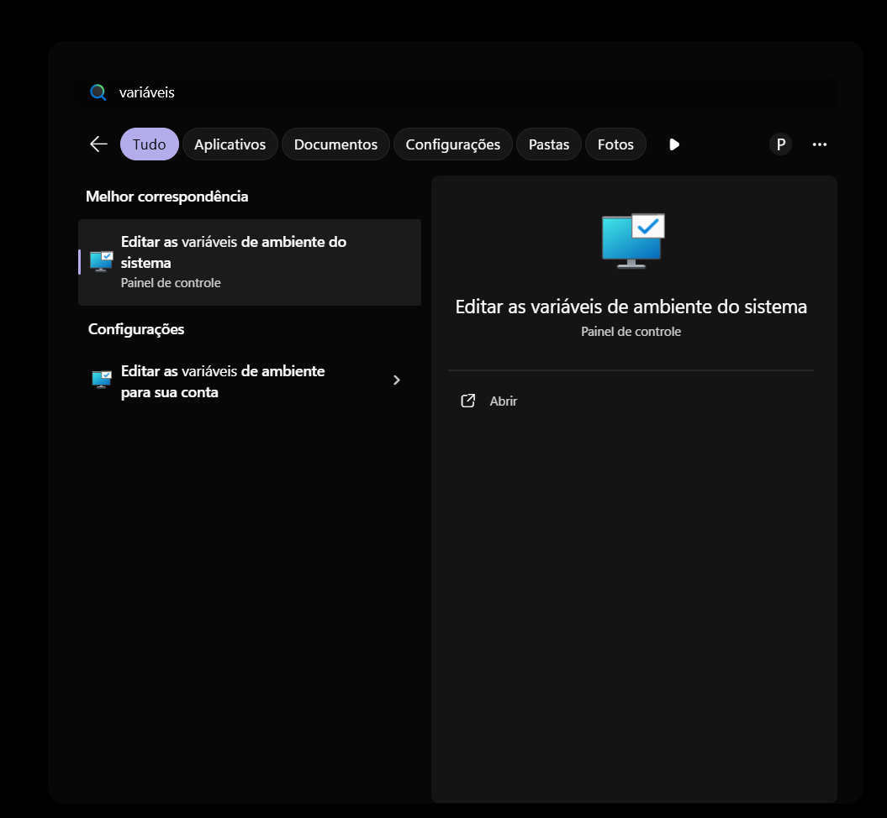
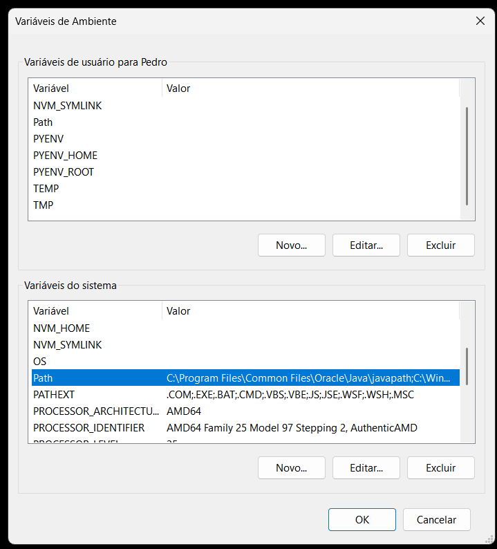
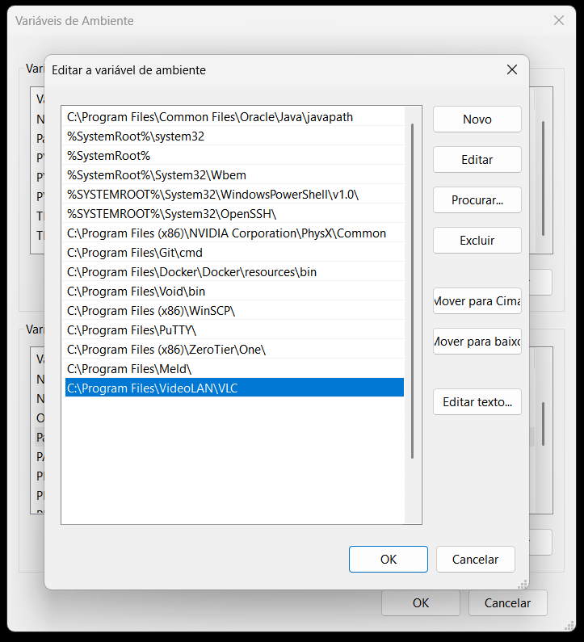
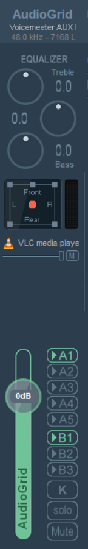

# AudioGrid

Aplicação simples em node + electron para ler arquivos mp3 de uma pasta e montar um grid em janela e servidor WEB de botões para reproduzir os áudios.


## 📋 Pré-requisitos

- Windows 10/11
- VLC Media Player
- Voicemeeter (Banana ou Potato)
- Discord (opcional, para uso com áudio)

## 🚀 Instalação e Configuração

### Passo 1: Download do AudioGrid

Baixe o último release do AudioGrid no GitHub:
https://github.com/pladombrowski/AudioGrid/releases

### Passo 2: Download do VLC Media Player

1. Acesse: http://www.videolan.org/vlc/
2. Baixe e instale a versão mais recente do VLC
3. **Importante**: Durante a instalação, certifique-se de marcar a opção "Add to PATH" ou "Adicionar ao PATH"

### Passo 3: Download do Voicemeeter

1. Acesse: https://vb-audio.com/Voicemeeter/
2. Baixe o Voicemeeter Banana (recomendado) ou Potato
3. Instale o software

### Passo 4: Descompactar o AudioGrid

1. Extraia o arquivo baixado do AudioGrid em uma pasta de sua escolha

### Passo 5: Configurar VLC no PATH do Sistema

Para que o AudioGrid funcione corretamente, o VLC deve estar disponível no PATH do sistema:

#### 5.1: Abrir Configurações de Variáveis de Ambiente

1. Pressione `Windows + R` e digite `sysdm.cpl`
2. Clique em "OK"
3. Na janela "Propriedades do Sistema", clique na aba "Avançado"
4. Clique no botão "Variáveis de Ambiente..."



#### 5.2: Editar Variáveis de Ambiente

1. Na janela "Variáveis de Ambiente", localize a seção "Variáveis do sistema"
2. Selecione a variável "Path" e clique em "Editar..."


#### 5.3: Adicionar Caminho do VLC

1. Na janela "Editar a variável de ambiente", clique em "Novo"
2. Adicione o caminho: `C:\Program Files\VideoLAN\VLC`
3. Clique em "OK" em todas as janelas para salvar




**Nota**: Se o VLC foi instalado em outro local, ajuste o caminho conforme necessário.

### Passo 6: Configurar Voicemeeter

#### 6.1: Configuração Básica

1. Abra o Voicemeeter
2. Configure sua entrada de microfone no canal "Hardware Input 1" (A1)
3. Configure a saída do VLC no canal "Hardware Input 2" (A2) ou "VAIO3" (A3)

#### 6.2: Configurar Saída B1

1. No Voicemeeter, configure a saída "B1" para receber o áudio do VLC
2. Certifique-se de que o botão "B1" está ativado (verde) para o canal onde o VLC está conectado



### Passo 7: Configurar Discord (Opcional)

Se você usar o Discord, configure a entrada de áudio para usar o Voicemeeter:

1. Abra o Discord
2. Vá em Configurações > Voz e Vídeo
3. Em "Dispositivo de entrada", selecione "Voicemeeter Out B1 (VB-Audio Voicemeeter VAIO)"


## 🎵 Como Usar

1. Execute o `AudioGrid.exe`
2. A aplicação irá:
   - Escanear a pasta `audios` em busca de arquivos MP3
   - Criar um grid de botões para cada áudio encontrado
   - Iniciar um servidor web local na porta 3000

3. Clique nos botões para reproduzir os áudios
4. Os áudios serão reproduzidos através do VLC e roteados pelo Voicemeeter

## 🔧 Solução de Problemas

### VLC não encontrado
- Verifique se o VLC está instalado e no PATH do sistema
- Reinicie o computador após configurar as variáveis de ambiente
- Teste executando `vlc` no prompt de comando

### Áudio não sai no Voicemeeter
- Verifique se o VLC está configurado para usar a saída correta
- Confirme se o Voicemeeter está recebendo o áudio do VLC
- Verifique os níveis de áudio no Voicemeeter

### Discord não recebe áudio
- Confirme se o Discord está configurado para usar "Voicemeeter Out B1"
- Verifique se o Voicemeeter está enviando áudio para a saída B1


## Código Fonte

Para rodar, o sistema deve estar configurado com node e electron já.

```bash
npm install
npm start
```

Para compilar, o sistema deve ter instalado o electron-packager:

```bash
   npm install electron-packager -g
```

Windows
```bash
electron-packager . AudioGrid --overwrite --platform=win32 --icon=AudioGrid.ico --prune=true --out=release-builds
```

Linux
```bash
electron-packager . AudioGrid --overwrite --platform=linux --icon=AudioGrid.ico --prune=true --out=release-builds
```
