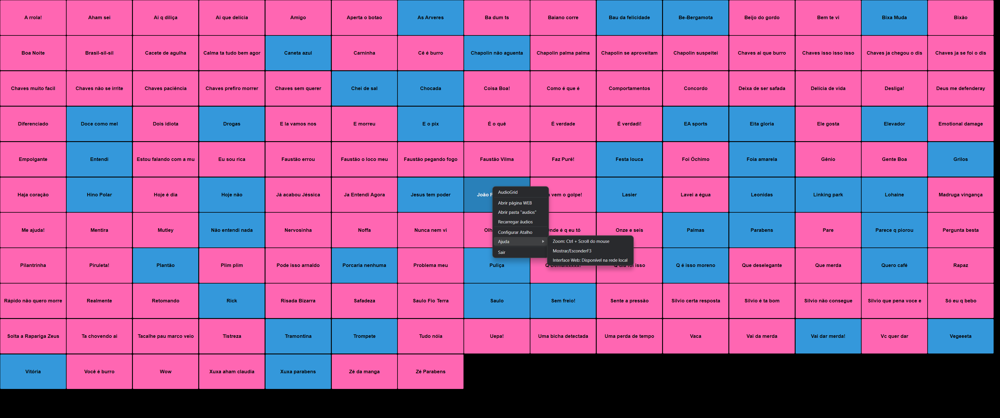

# AudioGrid

Aplicação simples em node + electron para ler arquivos mp3 de uma pasta e montar um grid em janela e servidor WEB de botões para reproduzir os áudios.




## Instalação

Instale o vlc: http://www.videolan.org/vlc/

O executável do vlc deve estar disponível no terminal/cmd

Baixe o binário do AudioGrid de acordo com o seu sistema operacional

Só executar o arquivo AudioGrid


## Código Fonte

Para rodar, o sistema deve estar configurado com node e electron já.

```bash
npm install
npm start
```

Para compilar, o sistema deve ter instalado o electron-packager:

```bash
  npm install
```

Windows
```bash
electron-packager . AudioGrid --overwrite --platform=win32 --icon=AudioGrid.ico --prune=true --out=release-builds
```

Linux
```bash
electron-packager . AudioGrid --overwrite --platform=linux --icon=AudioGrid.ico --prune=true --out=release-builds
```
