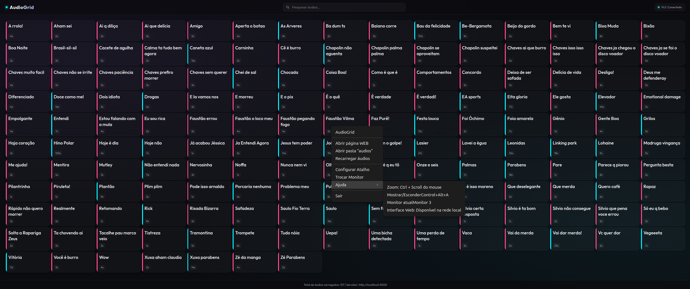
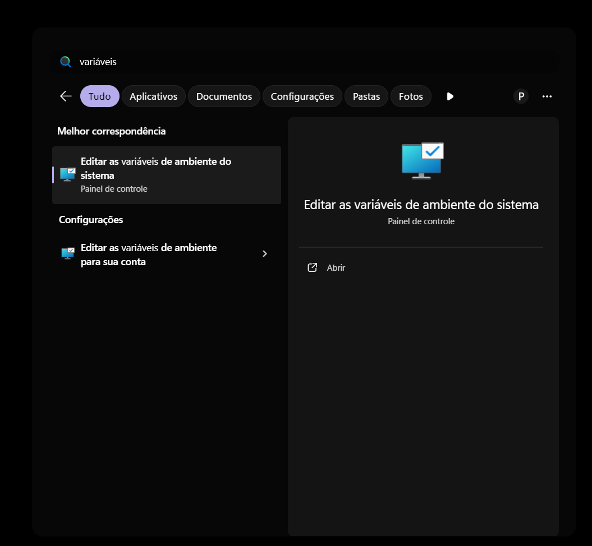
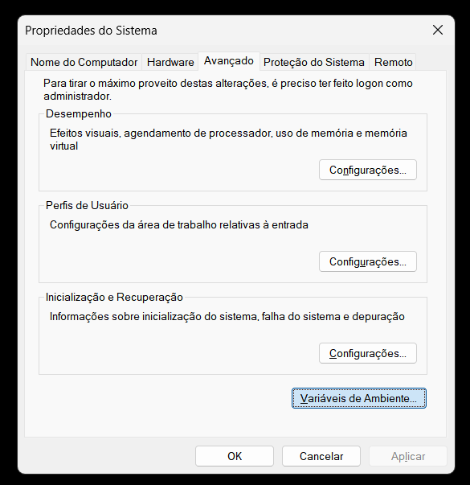
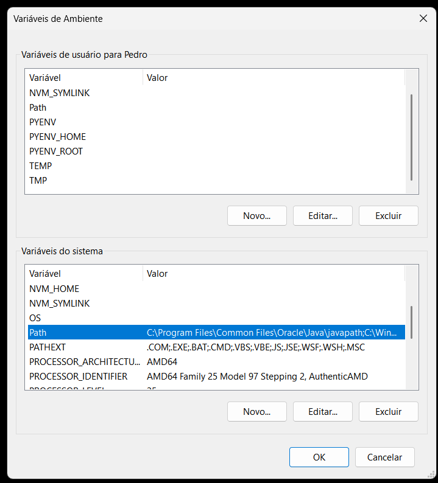
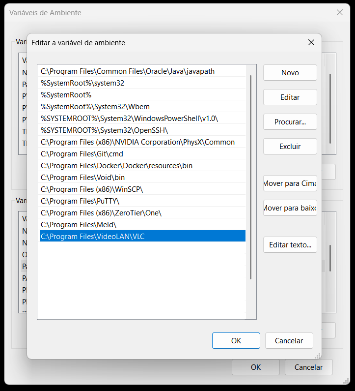
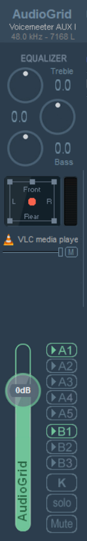
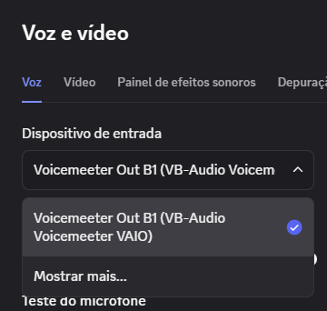
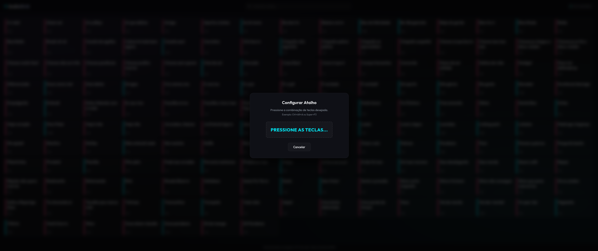

# AudioGrid

Aplicação simples em node + electron para ler arquivos mp3 de uma pasta e montar um grid em janela e servidor WEB de botões para reproduzir os áudios. Inclui sistema integrado de mixagem de áudio para uso com Discord, Google Meet e outras plataformas de comunicação.



## ✨ Novas Funcionalidades

- **🎵 Mixagem de Áudio Integrada**: Mistura áudio do app com microfone automaticamente
- **🖥️ Suporte a Múltiplos Monitores**: Troque o overlay para qualquer monitor
- **🌐 Interface Web**: Acesse via navegador na rede local
- **⌨️ Atalhos Customizados**: Configure atalhos globais (F1-F12) dinamicamente
- **⚙️ Configuração Fácil**: Menu de contexto intuitivo
- **🔧 API REST**: Controle completo via HTTP

## 📋 Pré-requisitos

### Windows
- Windows 10/11
- VLC Media Player
- VB-Cable (recomendado para mixagem de áudio)
- Discord/Google Meet (opcional, para uso com áudio)

### Linux
- Ubuntu/Debian/Fedora/Arch (ou similar)
- VLC Media Player
- PulseAudio (geralmente pré-instalado)
- Discord/Google Meet (opcional, para uso com áudio)

## 🚀 Instalação e Configuração

### ⚡ Configuração Rápida (Recomendado)

#### Linux
```bash
# Diagnóstico (se houver problemas)
./diagnose-audio.sh

# Correção automática (recomendado)
./fix-audio-linux.sh

# Configuração básica (alternativa)
./setup-audio-linux.sh
```

#### Windows
```powershell
# Execute o script de configuração automática
.\setup-audio-windows.ps1
```

### 📋 Instalação Manual

### Passo 1: Download do AudioGrid

Baixe o último release do AudioGrid no GitHub:
https://github.com/pladombrowski/AudioGrid/releases

### Passo 2: Download do VLC Media Player

1. Acesse: http://www.videolan.org/vlc/
2. Baixe e instale a versão mais recente do VLC
3. **Importante**: Durante a instalação, certifique-se de marcar a opção "Add to PATH" ou "Adicionar ao PATH"

### Passo 3: Download do Voicemeeter

1. Acesse: https://vb-audio.com/Voicemeeter/
2. Baixe o Voicemeeter Banana (recomendado) ou Potato
3. Instale o software

### Passo 4: Descompactar o AudioGrid

1. Extraia o arquivo baixado do AudioGrid em uma pasta de sua escolha

### Passo 5: Configurar VLC no PATH do Sistema

Para que o AudioGrid funcione corretamente, o VLC deve estar disponível no PATH do sistema:

#### 5.1: Abrir Configurações de Variáveis de Ambiente

1. Pressione `Windows + R` e digite `sysdm.cpl`
2. Clique em "OK"
3. Na janela "Propriedades do Sistema", clique na aba "Avançado"
4. Clique no botão "Variáveis de Ambiente..."



#### 5.2: Editar Variáveis de Ambiente

1. Na janela "Variáveis de Ambiente", localize a seção "Variáveis do sistema"
2. Selecione a variável "Path" e clique em "Editar..."



#### 5.3: Adicionar Caminho do VLC

1. Na janela "Editar a variável de ambiente", clique em "Novo"
2. Adicione o caminho: `C:\Program Files\VideoLAN\VLC`
3. Clique em "OK" em todas as janelas para salvar




**Nota**: Se o VLC foi instalado em outro local, ajuste o caminho conforme necessário.

### Passo 6: Configurar Voicemeeter

#### 6.1: Configuração Básica

1. Abra o Voicemeeter
2. Configure sua entrada de microfone no canal "Hardware Input 1" (A1)
3. Configure a saída do VLC no canal "Hardware Input 2" (A2) ou "VAIO3" (A3)

#### 6.2: Configurar Saída B1

1. No Voicemeeter, configure a saída "B1" para receber o áudio do VLC
2. Certifique-se de que o botão "B1" está ativado (verde) para o canal onde o VLC está conectado



### Passo 7: Configurar Discord (Opcional)

Se você usar o Discord, configure a entrada de áudio para usar o Voicemeeter:

1. Abra o Discord
2. Vá em Configurações > Voz e Vídeo
3. Em "Dispositivo de entrada", selecione "Voicemeeter Out B1 (VB-Audio Voicemeeter VAIO)"



## 🎵 Como Usar

### Uso Básico
1. Execute o `AudioGrid.exe` (Windows) ou `./AudioGrid` (Linux)
2. A aplicação irá:
   - Escanear a pasta `audios` em busca de arquivos MP3
   - Criar um grid de botões para cada áudio encontrado
   - Iniciar um servidor web local na porta 3000

3. Clique nos botões para reproduzir os áudios

### Mixagem de Áudio (Novo!)
1. Clique com botão direito na janela do AudioGrid
2. Selecione "Mixagem de Áudio"
3. Configure seus dispositivos de microfone e saída
4. Inicie a mixagem
5. No Discord/Meet, selecione o dispositivo virtual criado

### Múltiplos Monitores (Novo!)
1. Clique com botão direito na janela do AudioGrid
2. Selecione "Trocar Monitor"
3. Escolha o monitor desejado
4. O overlay será movido automaticamente

### Interface Web (Novo!)
1. Acesse `http://localhost:3000/remote` no navegador
2. Use o AudioGrid de qualquer dispositivo na rede local
3. Controle completo via interface web

### ⌨️ Atalhos Customizados (Novo!)
1. Clique com o botão direito na janela do AudioGrid
2. Selecione **Configurar Atalho**
3. Escolha o atalho desejado (F1-F12)
4. A configuração é aplicada instantaneamente e persistida em `config.json`

Você também pode verificar qual é o atalho ativo atual navegando em **Ajuda** → **Mostrar/Esconder: [ATALHO_ATUAL]** no menu de contexto.



### API REST (Novo!)
O AudioGrid inclui uma API REST completa para controle programático:

```bash
# Status da mixagem de áudio
curl http://localhost:3000/audio/status

# Iniciar mixagem
curl -X POST http://localhost:3000/audio/start-mixing

# Parar mixagem
curl -X POST http://localhost:3000/audio/stop-mixing

# Ajustar volume do microfone
curl -X POST http://localhost:3000/audio/set-volume \
  -H "Content-Type: application/json" \
  -d '{"type": "mic", "volume": 0.8}'

# Reproduzir áudio
curl -X POST http://localhost:3000/playAudio \
  -H "Content-Type: application/json" \
  -d '{"name": "meu_audio.mp3"}'

# Alternar exibição do overlay (Mostrar/Esconder janela)
curl http://localhost:3000/window/toggle
```

### ⌨️ Atalhos Globais no Linux (Wayland)

No Linux (particularmente Ubuntu com Wayland), o Electron é impedido de registrar atalhos de teclado globais nativamente por questões de segurança do servidor de exibição. Para configurar um atalho global estável:
1. Abra as **Configurações** do seu sistema.
2. Navegue até **Teclado** → **Atalhos de Teclado** → **Atalhos personalizados**.
3. Adicione um atalho personalizado:
   - **Nome**: `AudioGrid Toggle`
   - **Comando**: `curl http://localhost:3000/window/toggle`
   - **Tecla**: Escolha a tecla desejada (ex: `F3` ou `Super+F3`).
4. Clique em **Salvar**. Agora, pressionar essa tecla funcionará de forma robusta e imediata para exibir ou ocultar o overlay!

## 🔧 Solução de Problemas

### Linux - Problemas de Áudio
```bash
# Diagnóstico completo
./diagnose-audio.sh

# Correção automática
./fix-audio-linux.sh

# Verificar se AudioGrid Mix foi criado
pactl list short sinks | grep audiogrid
pactl list short sources | grep audiogrid
```

**Problemas Comuns:**
- **PulseAudio não inicia**: Execute `systemctl --user restart pulseaudio`
- **Sem dispositivos de áudio**: Execute `sudo usermod -a -G audio $USER` e reinicie
- **AudioGrid Mix não aparece**: Execute `./fix-audio-linux.sh`
- **Permissões negadas**: Verifique se está no grupo audio

### Windows - Problemas de Áudio
- **VB-Cable não funciona**: Reinstale o VB-Cable e reinicie o sistema
- **Áudio não sai**: Verifique se o VB-Cable está configurado como dispositivo padrão
- **Latência alta**: Ajuste as configurações de buffer no VB-Cable

### Problemas Gerais
- **VLC não encontrado**: Verifique se o VLC está instalado e no PATH do sistema
- **Mixagem não inicia**: Verifique se há dispositivos de áudio disponíveis
- **Volume muito baixo**: Ajuste os volumes no menu de configuração
- **Eco/feedback**: Reduza o volume do microfone ou use fones de ouvido


## Código Fonte

Para executar em modo de desenvolvimento (o Node.js e npm devem estar instalados):

```bash
npm install
npm start
```

Para compilar e gerar os executáveis (empacotados sem loops recursivos):

#### Linux (Ubuntu/Debian/Arch/Fedora)
```bash
npm run build-ubuntu
```

#### Windows
```bash
npm run build-windows
```

